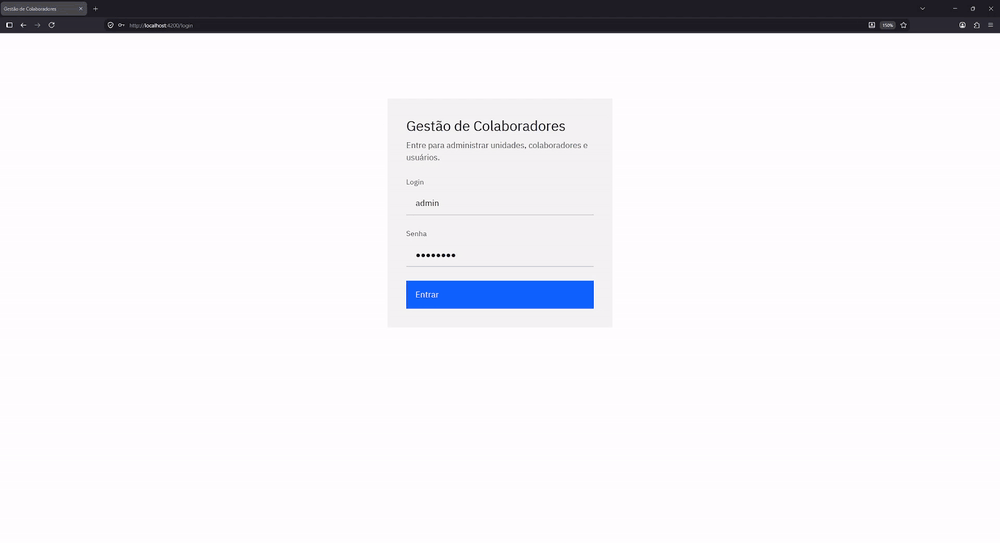
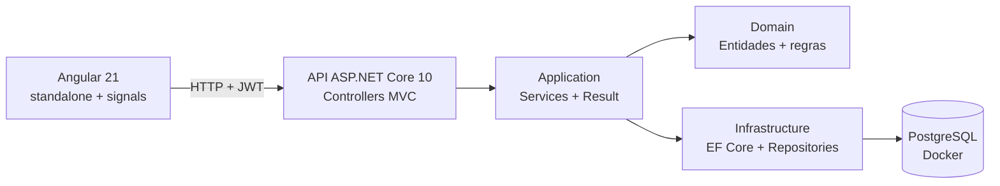

# Sistema de Gestão de Colaboradores e Unidades

[](https://github.com/PedroUbine06s/PedroUbine06s-20260828/actions/workflows/ci.yml)



Gestão de usuários, colaboradores e unidades: uma API ASP.NET Core com portal Angular,
cobrindo o CRUD das três entidades e a regra de que unidade inativa não recebe colaborador.

> [!NOTE]
> **O `.env` da raiz é versionado de propósito.** São valores de desenvolvimento de um banco
> em contêiner, recriado a cada `docker compose up`: não protegem dado algum. Versionar é o
> que permite clonar e rodar sem passo de configuração. Em produção, variáveis de ambiente
> com os mesmos nomes têm precedência e o `docker-compose.yml` não muda.

## Como rodar

```bash
docker compose up
```

Um comando sobe banco, API e portal. Não é preciso ter .NET nem Node na máquina.

- **Portal:** http://localhost:4200 — servido por nginx a partir do build de produção
- **API + Swagger:** http://localhost:5000/swagger
- **Login de avaliação:** `admin` / `admin123`

O startup aplica as migrations e semeia o banco. Os dados iniciais foram escolhidos para que
cada requisito seja testável sem preparo:

| Dado | Situação | Serve para testar |
|------|----------|-------------------|
| Unidade **Matriz** | ativa, 2 colaboradores | cadastro normal de colaborador |
| Unidade **Filial Centro** | **inativa**, 1 colaborador | **422** ao incluir novo colaborador, e que inativar não desvincula quem já estava |
| Usuário **admin** | ativo | login (`admin` / `admin123`) |
| Usuário **carlos.lima** | **inativo** | filtro `?ativo=false` e recusa de login |

Os demais usuários usam a senha `senha123`. Os códigos (`USR000001`, `UNI000001`,
`COL000001`) são gerados pelo sistema — liste os recursos para descobrir os Ids.

## Arquitetura



O requisito de **arquitetura MVC** é atendido pelo ASP.NET Core MVC: controllers fazem o
papel de *controller*, entidades e DTOs o de *model*, e a *view* é o portal Angular
consumindo JSON — a separação que o padrão pede, com a apresentação desacoplada em vez de
renderizada no servidor. Sobre isso está a divisão em camadas.

Quatro projetos, um por camada, com a dependência sempre apontando para dentro:
`Infrastructure` implementa as interfaces declaradas em `Application`. Ficou de fora a
subdivisão que Clean Architecture costuma trazer junto — projetos separados para casos de
uso, contratos e adaptadores —, que num domínio de 3 entidades multiplicaria arquivos sem
mudar nada.

## Patterns aplicados

| Pattern | Onde | Por quê |
|---------|------|---------|
| **Herança + Template Method** | [`BaseEntity` / `EntidadeAtivavel`](backend/src/GestaoColaboradores.Domain/Common/) | `Unidade` herda ativação e expõe `PodeReceberColaborador` |
| **Factory Method** | [`Colaborador.Criar`](backend/src/GestaoColaboradores.Domain/Entidades/Colaborador.cs) | Construtor privado: a entidade nunca existe em estado inválido |
| **Repository + Unit of Work** | [`Repository<T>` / `UnitOfWork`](backend/src/GestaoColaboradores.Infrastructure/Persistence/) | UoW é casca fina — o `DbContext` já implementa o pattern |
| **Result Pattern** | [`Result.cs`](backend/src/GestaoColaboradores.Application/Common/Result.cs) | Falha de regra não é exceção; o controller base traduz em 404/409/422 |
| **Strategy** | [`IPasswordHasher` → BCrypt](backend/src/GestaoColaboradores.Infrastructure/Auth/BCryptPasswordHasher.cs) | Hash trocável e mockável |
| **Options** | [`JwtSettings`](backend/src/GestaoColaboradores.Infrastructure/Auth/JwtSettings.cs) | Configuração tipada |

**Deliberadamente evitados:** CQRS/MediatR, Domain Events, Clean Architecture multi-projeto e
**transações explícitas** — o `SaveChanges` já é transacional e há um commit por operação, e a
concorrência entre requisições é resolvida pelo índice único.

## Decisões de domínio

- **Unidade inativa não recebe colaborador** — regra no domínio
  (`Unidade.PodeReceberColaborador` + guarda em `Colaborador.Criar`), devolvendo **422**.
- **Update de usuário limitado a senha e status por contrato** — o DTO só tem esses campos: a
  API impede o erro em vez de validá-lo depois.
- **Remoção de colaborador inativa o usuário vinculado** — apagá-lo destruiria o histórico e
  deixá-lo ativo manteria credencial válida sem dono. As duas alterações vão no mesmo commit.
- **Um usuário pertence a um único colaborador (1:1)** — o enunciado exige usuário para todo
  colaborador, mas é silencioso sobre a recíproca. Com 1:N dois colaboradores dividiriam um
  login e o registro de quem fez o quê deixaria de identificar alguém. Garantido por índice
  único, devolve **409**.
- **Rate limiting só no login** — é onde a defesa contra enumeração cobra caro: o BCrypt roda
  mesmo quando o login não existe, então uma requisição inválida passou de ~1 ms para ~100 ms
  de CPU. A janela é por IP, para um atacante não trancar a porta dos demais, e o limite é
  configurável (`RateLimit:LoginPorMinuto`) porque é número de operação, não de código: o
  padrão é 5, adequado a um login exposto na internet, e o contêiner sobe com 20, porque ali
  não existe esse modelo de ameaça e 5 transformaria explorar a API em esbarrar em 429.
- **Concorrência otimista por token de versão** — `Versao` entra no `WHERE` do `UPDATE` e o
  conflito vira **409** em vez de sobrescrever em silêncio. Não uso `xmin` porque o suporte
  saiu do Npgsql 10. **Escopo honesto:** protege a janela dentro de uma requisição; o caso
  "abri o formulário há cinco minutos" exigiria `If-Match`, não implementado.
- **Segredo do JWT validado no arranque** — a aplicação **recusa subir** com o valor de
  desenvolvimento fora de Development, e exige 32 caracteres. Configuração errada deve
  derrubar o processo, não ficar silenciosa.
- **UUID v7 gerado no domínio** — ordenado no tempo, preserva a localidade de índice que o v4
  destruiria. Gerar na entidade faz o objeto nascer com identidade, dispensando gravar o
  principal antes de vincular o dependente.
- **Código de negócio gerado por sequence** — `nextval` é atômico; um "maior valor + 1" na
  aplicação teria corrida entre leitura e gravação.
- **Referências por Id, não por código** — como o código virou saída do sistema, exigi-lo de
  volta como entrada inverteria o fluxo. O Id é o que volta no `Location` e nas listagens.
- **Normalização de entrada na borda, com opt-out** — toda string do corpo perde espaços das
  pontas na desserialização. Um `JsonConverter<string>` não bastaria: ele vê o valor, não a
  propriedade, e a customização de contrato roda com os atributos ainda visíveis, pulando o
  que tem `[NaoNormalizar]`.
- **Senha nunca é normalizada** — cortar espaços alteraria em silêncio o que a pessoa digitou,
  e passphrases com espaço são mais fortes (NIST SP 800-63B).
- **Limites de tamanho em constante única** — lidos pela validação do domínio e pelo
  `HasMaxLength`, então o domínio não aceita o que a coluna rejeitaria.
- **`Colaborador` é entidade de primeira classe, não parte do agregado `Unidade`** — DDD
  estrito faria `unidade.AdicionarColaborador(...)`, mas o enunciado exige código e CRUD
  próprios, o que obrigaria a carregar a unidade inteira a cada operação.

## API

Autenticação: `POST /api/v1/auth/login` → Bearer token (só usuário **ativo** loga).
Todos os demais endpoints exigem o token.

| Método | Rota | Descrição |
|--------|------|-----------|
| GET | `/api/v1/usuarios?ativo=&semColaborador=&pagina=&tamanho=` | Lista usuários. `semColaborador=true` traz só quem ainda não tem colaborador |
| GET | `/api/v1/usuarios/{id}` | Retorna um usuário |
| POST | `/api/v1/usuarios` | Cadastra usuário |
| PUT | `/api/v1/usuarios/{id}` | Atualiza **somente** senha e status |
| PATCH | `/api/v1/usuarios/{id}` | Atualização parcial |
| GET | `/api/v1/colaboradores?pagina=&tamanho=` | Lista colaboradores com a unidade |
| GET | `/api/v1/colaboradores/{id}` | Retorna um colaborador |
| POST | `/api/v1/colaboradores` | Cadastra (409 duplicado / 422 unidade inativa) |
| PUT | `/api/v1/colaboradores/{id}` | Atualiza nome e unidade |
| PATCH | `/api/v1/colaboradores/{id}` | Renomeia ou transfere, sem exigir os dois campos |
| DELETE | `/api/v1/colaboradores/{id}` | Remove colaborador |
| GET | `/api/v1/unidades?pagina=&tamanho=` | Lista unidades com seus colaboradores |
| GET | `/api/v1/unidades/{id}` | Retorna uma unidade com seus colaboradores |
| POST | `/api/v1/unidades` | Cadastra unidade |
| PUT | `/api/v1/unidades/{id}` | Atualiza nome / ativa / inativa |
| PATCH | `/api/v1/unidades/{id}` | Inativa com apenas `{"ativo": false}` |

**PUT e PATCH coexistem por semântica.** O `PUT` substitui a representação mutável inteira e
exige todos os campos; o `PATCH` aplica só o que foi enviado. É a diferença entre "a unidade
passa a ser assim" e "apenas inative a unidade". `PATCH` sem campo algum é recusado com 400.

Listagens são **paginadas** e devolvem `{ itens, pagina, tamanho, total, totalDePaginas }`,
padrão 20 e teto 100 — sem teto, `?tamanho=1000000` reproduziria o problema que a paginação
evita. `GET /health` verifica API e banco, sem token.

Erros seguem **ProblemDetails (RFC 7807)**, montados pela mesma `ProblemDetailsFactory` nos
erros de regra e nos traduzidos pelo middleware: um 409 é indistinguível vindo de um caminho
ou do outro.

**Limitação conhecida:** o middleware traduz *qualquer* violação de unicidade em 409. Se uma
sequence dessincronizasse do conteúdo da tabela, o cliente receberia 409 por um campo que nem
envia. Distinguir exigiria acoplar o middleware a nomes de constraint gerados pelo EF, que
quebram ao renomear uma entidade — preferi a falha genérica à frágil.

A collection do Postman em [`postman/`](postman/) tem **35 requisições** cobrindo caminhos
felizes e de erro (401, 400, 404, 409, 422), com testes automáticos de status e corpo — roda
inteira com `newman run` e passa contra o seed intacto.

Ela escreve no banco e é **idempotente**: o usuário criado leva um login único por execução,
porque um usuário pertence a um único colaborador e um login fixo colidiria em 409 na
repetição. Roda quantas vezes for preciso.

## Testes

```bash
cd backend && dotnet test     # 95 testes
cd frontend && npm test       # 33 testes
```

**95 no backend.** Os **64 de unidade** (xUnit + NSubstitute) cobrem o domínio sem mock algum
e verificam efeito, não só retorno: quando uma regra falha, o teste assere que `CommitAsync`
**não** foi chamado. Os **31 de integração** (`WebApplicationFactory` + **Testcontainers**)
sobem um PostgreSQL real — não se usa InMemory de propósito, porque ele não tem índice único,
e é o índice que garante a unicidade de código e login.

Alguns que valem destaque: o login roda BCrypt mesmo quando o usuário não existe, porque
mensagem igual não bastaria se o tempo entregasse a diferença; a resposta de usuários nunca
contém "senha" nem "hash"; remover colaborador inativa o usuário na mesma transação; renomear quem ficou numa unidade
inativa continua possível, enquanto transferir alguém para ela é recusado; o filtro
`semColaborador` some com o usuário assim que ele ganha colaborador, sem anular o filtro de
status; e duas criações seguidas nunca recebem o mesmo código.

**33 no portal**, com Vitest pelo builder `@angular/build:unit-test` — e não Karma, que está
em depreciação no Angular. O alvo mais valioso é a expiração do token: válido, vencido, sem
`exp`, `exp` não numérico e token corrompido, porque um valor estragado no `localStorage` não
pode derrubar a aplicação no boot. Nos serviços a asserção é sobre a query string, onde o
contrato mora: filtro ausente e filtro `false` são coisas diferentes.

## Portal

Angular 21 com componentes standalone — os únicos NgModules são os que o Carbon exporta.
Signals para estado, `input()`/`output()` entre componentes e o control flow novo (`@if`,
`@for`). Um interceptor anexa o `Bearer` e outro centraliza o erro: 401 encerra a sessão, o
resto vira toast lendo o `detail` do ProblemDetails. Status 0 e 429 ganham mensagem própria,
porque nesses casos não há ProblemDetails para ler.

**Carbon, e o que ele impôs.** O design system é o IBM Carbon (`carbon-components-angular`
5.72.2), escolhido em vez do Angular Material por ter identidade própria. O risco era real: a
lib **não declara `@angular/*` nas peerDependencies** e publica declarações Ivy geradas com o
compilador **14.3.0**. A compatibilidade foi estabelecida compilando — um spike de um botão
antes de qualquer tela — e o linker do Angular **21.2.22** as aceita, sem downgrade. O que o
Carbon impôs foi manter o Zone.js, por ser uma lib dessa era. As tabelas usam as classes
`cds--data-table` sobre markup nativo: o `cds-table` exige um `TableModel` imperativo que
brigaria com signals.

**Servido por nginx.** A imagem é multi-stage: o Node builda e some. O nginx assume as duas
funções do `ng serve` — devolver o `index.html` em qualquer rota, sem o que abrir
`/usuarios?status=inativos` direto daria 404, e encaminhar `/api/` para a API. Consequência
de pôr um proxy na frente: o rate limit por IP passa a ver o IP do contêiner para todo mundo;
num ambiente real a correção seria honrar `X-Forwarded-For` com `UseForwardedHeaders`.

**Sessão.** O JWT fica em `localStorage` e o guard chama `sessaoValida()`, que reavalia o
`exp` a cada navegação em vez de só checar se há token: sem isso, um token vencido passava, a
tela montava e só o 401 devolvia a pessoa ao login. Ler o `exp` no cliente é decisão de
experiência, não de segurança — o payload é base64 e qualquer um forja validade; quem valida
assinatura é a API. `localStorage` é legível por script injetado, e a alternativa robusta
seria cookie `httpOnly` com CSRF; ficou de fora pelo custo, como tradeoff assumido.

**Estado na URL.** Página e filtro vivem na query string, então F5, botão voltar e
compartilhar `/usuarios?status=inativos` funcionam sem código extra.

### O que a tela impede antes de a API recusar

O select de unidades lista **apenas as ativas**, evitando o 422 em vez de esperar por ele. Se
nenhuma estiver ativa, o campo explica o motivo. Na edição há uma exceção deliberada: a
unidade atual continua na lista mesmo inativa, senão editar só o nome moveria a pessoa de
unidade sem querer.

A regra 1:1 recebeu o mesmo tratamento, mas exigiu mexer na API. `ColaboradorRespostaDto` não
expõe o `usuarioId`, então o portal não sabia quem já estava vinculado — e cruzar isso no
cliente obrigaria a varrer todas as páginas de colaboradores. O filtro foi para onde a
pergunta pertence: `GET /usuarios?semColaborador=true` vira um `EXISTS` no SQL, com a
paginação recortando depois do filtro.

O tratamento do 409 continua no código: filtrar é conveniência, não garantia — dois cadastros
simultâneos ainda disputam o mesmo usuário. A autoridade fica no servidor.

### Limitações conscientes

- Os componentes de tela não têm teste automatizado: a suíte cobre serviços e sessão, e as
  telas foram verificadas no navegador, incluindo 409, unidade inativa e token expirado.
- Os selects de apoio carregam com `?tamanho=100`, o teto da API. Acima disso seria preciso um
  campo com busca no servidor — o filtro já é server-side, falta a busca por texto.

## Desenvolvimento local

Para rodar fora do Docker, com recarga automática:

```bash
dotnet tool restore                                        # dotnet-ef na versão do repositório
cd backend && dotnet run --project src/GestaoColaboradores.Api
cd frontend && npm install && npm start                    # usa o proxy do ng serve
```

A migration inicial está versionada em `Infrastructure/Migrations` e é aplicada no startup.
Para criar novas:

```bash
dotnet ef migrations add <Nome> -p src/GestaoColaboradores.Infrastructure -s src/GestaoColaboradores.Api
```
