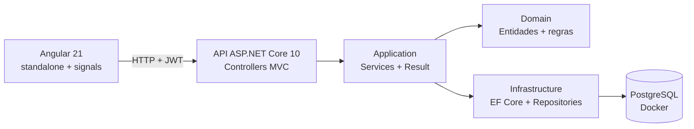

# Sistema de Gestão de Colaboradores e Unidades

<!-- TODO: uma frase de apresentação + GIF de ~20s navegando no portal -->

Gestão de usuários, colaboradores e unidades: uma API ASP.NET Core com portal Angular,
cobrindo o CRUD das três entidades e a regra de que unidade inativa não recebe colaborador.

## Como rodar

```bash
docker compose up
```

Um comando sobe o sistema inteiro — banco, API e portal:

- **Portal:** http://localhost:4200
- **API + Swagger:** http://localhost:5000/swagger
- **Login de avaliação:** `admin` / `admin123`

O portal é servido por nginx a partir do build de produção, e não pelo `ng serve`. Não é
preciso ter Node na máquina para avaliar o projeto.

O startup aplica as migrations e semeia o banco automaticamente. Os dados iniciais foram
escolhidos para que cada requisito seja testável sem preparo:

| Dado | Situação | Serve para testar |
|------|----------|-------------------|
| Unidade **Matriz** | ativa, 2 colaboradores | cadastro normal de colaborador |
| Unidade **Filial Centro** | **inativa**, 1 colaborador | **422** ao tentar incluir novo colaborador, e que inativar não desvincula quem já estava |
| Usuário **admin** | ativo | login (`admin` / `admin123`) |
| Usuário **carlos.lima** | **inativo** | filtro `GET /usuarios?ativo=false` e recusa de login |

Os demais usuários usam a senha `senha123`. Os códigos (`USR000001`, `UNI000001`,
`COL000001`) são gerados pelo sistema — liste os recursos para descobrir os Ids.

## Arquitetura



Quatro projetos, um por camada. A dependência aponta sempre para dentro: `Api` conhece
`Application`, que conhece `Domain`; `Infrastructure` implementa as interfaces declaradas em
`Application`. O que ficou de fora, deliberadamente, foi a subdivisão que Clean Architecture
costuma trazer junto — projetos separados para casos de uso, contratos e adaptadores. Para um
domínio de 3 entidades isso multiplicaria arquivos sem mudar nada de fato.

## Patterns aplicados

| Pattern | Onde | Por quê |
|---------|------|---------|
| **Herança + Template Method** | [`BaseEntity` / `EntidadeAtivavel`](backend/src/GestaoColaboradores.Domain/Common/) | Requisito do teste resolvido com regra real: `Unidade` herda ativação e expõe `PodeReceberColaborador` |
| **Factory Method** | [`Colaborador.Criar`](backend/src/GestaoColaboradores.Domain/Entidades/Colaborador.cs) | Construtor privado: a entidade nunca existe em estado inválido |
| **Repository + Unit of Work** | [`Repository<T>` / `UnitOfWork`](backend/src/GestaoColaboradores.Infrastructure/Persistence/) | UoW é uma casca fina — o `DbContext` do EF Core já implementa o pattern via `SaveChanges` |
| **Result Pattern** | [`Result.cs`](backend/src/GestaoColaboradores.Application/Common/Result.cs) | Falha de regra de negócio não é exceção; o controller base traduz em 404/409/422 |
| **Strategy** | [`IPasswordHasher` → BCrypt](backend/src/GestaoColaboradores.Infrastructure/Auth/BCryptPasswordHasher.cs) | Algoritmo de hash trocável e mockável nos testes |
| **Options** | [`JwtSettings`](backend/src/GestaoColaboradores.Infrastructure/Auth/JwtSettings.cs) | Configuração tipada, o idiomático .NET |

**Deliberadamente evitados:** CQRS/MediatR (peso morto para 3 entidades), Domain Events
(nenhum efeito colateral no enunciado justifica), Clean Architecture multi-projeto e
**transações explícitas** — o `SaveChanges` do EF Core já é transacional e a arquitetura faz
um único commit por operação, então `BeginTransaction` só acrescentaria cerimônia. A
concorrência entre requisições simultâneas é resolvida pelo índice único, não por transação.

## Decisões de domínio

- **Unidade inativa não recebe colaborador** — regra expressa no domínio
  (`Unidade.PodeReceberColaborador` + guarda em `Colaborador.Criar`), verificada também no
  serviço e retornando **422** na API.
- **Update de usuário limitado a senha e status por contrato**: o DTO de atualização só
  possui esses dois campos — a API impede o erro em vez de validá-lo depois.
- **Remoção de colaborador inativa o usuário vinculado** — das três saídas possíveis, apagar
  o usuário destruiria o histórico de quem fez o quê, e deixá-lo ativo manteria uma
  credencial válida sem dono. Inativar encerra o acesso preservando o rastro. As duas
  alterações acontecem no mesmo commit, então ou ambas valem ou nenhuma vale.
- **Um usuário pertence a um único colaborador (1:1)** — o enunciado exige que todo
  colaborador tenha um usuário, mas é silencioso sobre a recíproca. Escolhi 1:1 para que
  credencial e pessoa sejam a mesma identidade: com 1:N, dois colaboradores compartilhariam
  um login e o registro de quem fez o quê deixaria de identificar alguém. O custo é não
  suportar a mesma pessoa ocupando dois cargos, cenário que o enunciado não pede. A regra é
  garantida por índice único e checada antes de inserir, devolvendo **409**.
- **Senhas:** BCrypt; hash jamais exposto em resposta.
- **Rate limiting só no login** — é o endpoint que um atacante repete milhares de vezes, e
  cada tentativa custa um BCrypt ao servidor. Esse custo é consequência direta da defesa
  contra enumeração: o hash roda mesmo quando o login não existe, então uma requisição
  inválida passou de ~1 ms para ~100 ms de CPU. A troca é deliberada, e o rate limiting é o
  que impede que ela vire um vetor de exaustão. A janela é por IP, para que um atacante não
  consiga trancar a porta dos demais, e o limite é configurável (`RateLimit:LoginPorMinuto`)
  porque esse é um número que operação ajusta, não desenvolvimento.
- **Concorrência otimista por token de versão** — cada entidade tem um `Versao` que muda a
  cada alteração e entra no `WHERE` do `UPDATE`; um conflito vira **409** em vez de
  sobrescrever em silêncio. Não usei a coluna `xmin` do PostgreSQL porque o suporte a ela foi
  removido do provider Npgsql 10, e uma coluna própria ainda funciona em qualquer banco.
  **Escopo honesto:** isso protege a janela entre a leitura e a gravação *dentro de uma
  requisição*. O caso "abri o formulário há cinco minutos" exigiria devolver a versão ao
  cliente e recebê-la de volta via `If-Match`, o que não foi implementado.
- **Segredo do JWT validado no arranque** — o valor versionado em `appsettings.json` é de
  desenvolvimento e a aplicação **recusa subir** com ele fora de Development, além de exigir
  no mínimo 32 caracteres. Configuração errada deve derrubar o processo, não ficar silenciosa
  até alguém explorá-la.
- **Identificador é UUID v7, gerado no domínio** — a versão 7 é ordenada no tempo, então
  preserva a localidade do índice que um UUID v4 destruiria com inserções espalhadas. Gerar
  na entidade, e não no banco, faz o objeto nascer com identidade: dá para montar o grafo
  inteiro e gravar num commit só, sem salvar o principal antes de vincular o dependente.
- **Código de negócio gerado pelo sistema, via sequence** — `USR000001`, `UNI000001`,
  `COL000001` deixaram de ser entrada do cliente. A numeração usa sequences do PostgreSQL
  porque `nextval` é atômico: duas requisições simultâneas nunca recebem o mesmo número.
  Um "maior valor + 1" na aplicação teria corrida entre a leitura e a gravação.
- **Referências por Id, não por código** — como o código passou a ser saída do sistema,
  exigir que o cliente o reenviasse como entrada seria inverter o fluxo. O Id é o
  identificador canônico: é o que volta no `Location` e nas listagens.
- **Limites de tamanho em constante única** — `BaseEntity.TamanhoMaximoCodigo` e afins são
  lidos tanto pela validação do domínio quanto pelo `HasMaxLength` do schema, de modo que o
  domínio não tem como aceitar um valor que a coluna rejeitaria.
- **Normalização de entrada na borda, com opt-out explícito** — toda string do corpo da
  requisição perde os espaços das pontas na desserialização, então nenhuma camada abaixo
  precisa lembrar de limpar. Um `JsonConverter<string>` global não bastaria, porque ele
  enxerga o valor e não a propriedade de origem: a customização de contrato
  (`Normalizacao.Configurar`) roda quando os atributos ainda são visíveis e pula o que estiver
  marcado com `[NaoNormalizar]`.
- **Senha nunca é normalizada** — os campos de senha carregam `[NaoNormalizar]`. Cortar
  espaços alteraria em silêncio o que a pessoa digitou, e passphrases com espaço são mais
  fortes, não mais fracas: o NIST SP 800-63B recomenda aceitar todo caractere imprimível e
  desaconselha regras de composição que reduzam o espaço de senhas.
- **`Colaborador` é entidade de primeira classe, não parte do agregado `Unidade`** — um
  desenho estrito de DDD faria `unidade.AdicionarColaborador(...)`, com a unidade como raiz.
  Optei pelo acesso direto porque o enunciado exige código único e CRUD próprios para
  colaborador, o que exigiria carregar a unidade inteira a cada operação.

## API

Autenticação: `POST /api/v1/auth/login` → Bearer token (só usuário **ativo** loga).
Todos os demais endpoints exigem o token.

| Método | Rota | Descrição |
|--------|------|-----------|
| GET | `/api/v1/usuarios?ativo=&semColaborador=&pagina=&tamanho=` | Lista usuários. `semColaborador=true` traz só quem ainda não tem colaborador |
| GET | `/api/v1/usuarios/{id}` | Retorna um usuário |
| POST | `/api/v1/usuarios` | Cadastra usuário |
| PUT | `/api/v1/usuarios/{id}` | Atualiza **somente** senha e status |
| PATCH | `/api/v1/usuarios/{id}` | Atualização parcial: envie só os campos que mudam |
| GET | `/api/v1/colaboradores?pagina=&tamanho=` | Lista colaboradores com a unidade |
| GET | `/api/v1/colaboradores/{id}` | Retorna um colaborador |
| POST | `/api/v1/colaboradores` | Cadastra colaborador (409 duplicado / 422 unidade inativa) |
| PUT | `/api/v1/colaboradores/{id}` | Atualiza nome e unidade |
| PATCH | `/api/v1/colaboradores/{id}` | Renomeia ou transfere, sem exigir os dois campos |
| DELETE | `/api/v1/colaboradores/{id}` | Remove colaborador |
| GET | `/api/v1/unidades?pagina=&tamanho=` | Lista unidades com seus colaboradores |
| GET | `/api/v1/unidades/{id}` | Retorna uma unidade com seus colaboradores |
| POST | `/api/v1/unidades` | Cadastra unidade |
| PUT | `/api/v1/unidades/{id}` | Atualiza nome / ativa / inativa |
| PATCH | `/api/v1/unidades/{id}` | Inativa com apenas `{"ativo": false}` |

**PUT e PATCH coexistem por semântica, não por conveniência.** O `PUT` substitui a
representação mutável inteira e por isso exige todos os campos; o `PATCH` aplica apenas o que
foi enviado, e campo ausente significa "não altere". É a diferença entre "a unidade passa a
ser assim" e "apenas inative a unidade". Um `PATCH` sem nenhum campo é recusado com 400 — sem
campos não é um pedido de "não mude nada", é engano do cliente.

As listagens são **paginadas** e devolvem `{ itens, pagina, tamanho, total, totalDePaginas }`.
O padrão é 20 itens e o teto é 100 — sem teto, `?tamanho=1000000` reproduziria justamente o
problema que a paginação evita. `GET /health` verifica a API e o banco, e não exige token.

Erros seguem **ProblemDetails (RFC 7807)**, e o corpo é montado pela mesma
`ProblemDetailsFactory` tanto nos erros de regra quanto nos traduzidos pelo middleware — um
409 é indistinguível vindo de um caminho ou do outro.

**Limitação conhecida:** o middleware traduz *qualquer* violação de unicidade do banco em 409.
Se uma sequence de código dessincronizasse do conteúdo da tabela (um restore de dump sem
`setval`, por exemplo), o cliente receberia 409 por um campo que ele nem envia, já que o código
é gerado pelo sistema. Distinguir exigiria acoplar o middleware a nomes de constraint gerados
pelo EF, que quebram silenciosamente ao renomear uma entidade — preferi a falha genérica à
frágil, e registrá-la aqui.
A collection do Postman em [`postman/`](postman/) tem 30 requisições cobrindo os caminhos
felizes e os de erro (401, 400, 404, 409, 422), com testes automáticos que verificam o status
e o corpo. O login salva o token no environment, então basta rodá-lo primeiro.

## Testes

```bash
cd backend
dotnet test
```

**91 testes**, divididos em duas suítes com propósitos distintos.

Os **63 de unidade** (xUnit + NSubstitute) rodam em ~100 ms e cobrem o domínio sem mock algum
e os serviços com repositórios simulados. Eles verificam efeito, não só retorno: quando uma
regra falha, o teste assere que `CommitAsync` **não** foi chamado.

Os **28 de integração** (`WebApplicationFactory` + **Testcontainers**) sobem um PostgreSQL real
em contêiner e exercitam HTTP de ponta a ponta — pipeline de autenticação, validação, migrations
e seed inclusos. Não se usa InMemory provider aqui de propósito: ele não tem índice único, e é
justamente o índice que garante a unicidade de código e login.

Alguns que valem destaque: o login devolve mensagem indistinguível entre usuário inexistente e
senha errada, e roda o BCrypt mesmo quando o login não existe — mensagem igual não bastaria,
porque a diferença de tempo entregaria o que o texto esconde; a resposta de usuários **nunca**
contém a palavra "senha" nem "hash"; inativar unidade não desvincula quem já estava; remover colaborador inativa o
usuário na mesma transação; o filtro `semColaborador` deixa de listar um usuário assim que ele
ganha colaborador, e não anula o filtro de status quando os dois vêm juntos; o `PUT` recusa corpo incompleto enquanto o `PATCH` aceita; e duas criações seguidas nunca
recebem o mesmo código, o que cobra o comportamento da sequence.

### Testes do portal

```bash
cd frontend
npm test
```

**33 testes** com Vitest, pelo builder `@angular/build:unit-test`. Vitest e não Karma porque
o Karma está em depreciação no Angular e o Vitest roda headless, sem depender de um Chrome
instalado na máquina.

O alvo mais valioso é a expiração do token: cobre válido, vencido, sem `exp`, `exp` que não é
número e token corrompido — um valor estragado no `localStorage` não pode derrubar a
aplicação no boot. Cobre também o caso que motivou o conserto do guard: o token que vence com
a aba aberta, em que nenhum signal muda e só recalcular na hora percebe.

Nos serviços a asserção é sobre a query string, porque é ali que o contrato mora: filtro
ausente e filtro `false` são coisas diferentes, e `ativo=false` precisa ser enviado em vez de
omitido por ser falso.

A suíte foi conferida contra regressão proposital — desativando a checagem de expiração,
exatamente os dois testes dela falham.

## Portal

```bash
cd frontend
npm install
npm start
```

Angular 21 com componentes standalone — os únicos NgModules no projeto são os que o Carbon
exporta e que os componentes importam. Signals para estado, `input()`/`output()` para a
comunicação entre componentes e o control flow novo (`@if`, `@for`) nos templates. A
autenticação guarda o JWT em `localStorage`, um interceptor anexa o `Bearer` e um segundo
centraliza o erro — 401 encerra a sessão e volta ao login, o resto vira toast lendo o
`detail` do ProblemDetails. Status 0 e 429 ganham mensagem própria, porque nesses dois casos
não há ProblemDetails para ler.

### Carbon, e qual versão do Angular ele impôs

O design system é o **IBM Carbon** (`carbon-components-angular` 5.72.2), escolhido em vez do
Angular Material porque o Material é o visual padrão de quase todo projeto Angular e o Carbon
mostra a mesma competência com uma identidade própria.

A escolha tinha um risco real: a lib **não declara `@angular/*` nas peerDependencies**, então
não existe compatibilidade anunciada — e ela publica declarações Ivy parciais geradas com o
compilador **14.3.0**, dez versões atrás. A compatibilidade foi estabelecida compilando, com
um spike de um botão antes de qualquer tela: o linker do Angular **21.2.22** aceita essas
declarações, e o portal roda sem downgrade. Não foi preciso baixar a versão do Angular.

O que o Carbon **impôs** foi outra coisa: ele é uma biblioteca da era do Zone.js, então o
projeto mantém `provideZoneChangeDetection` em vez de migrar para zoneless. O `zone.js`
também não estava declarado como polyfill no `angular.json` — a aplicação quebrava no boot
com `NG0908`, o que era um defeito independente do Carbon.

As tabelas usam as classes `cds--data-table` sobre markup nativo, e não o `cds-table`. O
componente do Carbon exige um `TableModel` imperativo, populado com `TableItem[][]`, que
brigaria com signals e tornaria trabalhoso pôr botões de ação nas células. Os componentes
interativos — botão, campo, select, modal, toast, tag, paginação — são os do Carbon.

### Como o portal é servido

A imagem do portal é multi-stage: o Node builda e some, e a imagem final tem só o nginx com
os arquivos estáticos. O nginx faz duas coisas que o `ng serve` fazia em desenvolvimento —
devolve o `index.html` para qualquer rota desconhecida, sem o que abrir
`/usuarios?status=inativos` direto daria 404, e encaminha `/api/` para o contêiner da API,
no lugar do `proxy.conf.json`.

Uma consequência de pôr um proxy na frente: o rate limit do login conta por IP, e com o
nginx no caminho a API enxerga o IP do contêiner para todo mundo. No recorte de avaliação
isso não muda nada — o 429 continua acontecendo —, mas num ambiente real o limite passaria a
ser global em vez de por cliente, e a correção seria honrar o `X-Forwarded-For` com
`UseForwardedHeaders` e uma lista de proxies confiáveis.

Para desenvolver o front com recarga automática, o caminho continua sendo
`cd frontend && npm install && npm start`, que usa o proxy do `ng serve`.

### Sessão e estado de navegação

O JWT fica em `localStorage` e o signal do `AuthService` é inicializado a partir dele, então
recarregar não desloga. O guard chama `sessaoValida()`, que reavalia o `exp` do token a cada
navegação, em vez de apenas checar se existe token guardado: sem isso, um token vencido
passava pelo guard, a tela protegida montava, disparava a requisição e só o 401 devolvia a
pessoa ao login — um piscar da tela antes do chute.

Ler o `exp` no cliente é decisão de experiência, não de segurança: o payload é base64 e
qualquer um forja uma validade no futuro. Quem valida assinatura é a API, e é ela que
continua decidindo o 401 — o interceptor segue tratando esse caso.

`localStorage` é legível por qualquer script injetado na página. A alternativa robusta é
cookie `httpOnly` com proteção CSRF, que move a decisão para o servidor; ficou de fora porque
exigiria emissão de cookie, CORS com credenciais e token anti-CSRF, e o custo não se paga no
recorte deste teste. É um tradeoff assumido, não um esquecimento.

Página e filtro de status vivem na **query string**, não em signal local. O componente lê
`queryParamMap` e recarrega quando ele muda, então recarregar a página, usar o botão voltar
e compartilhar `/usuarios?status=inativos` funcionam sem código extra. A página 1 é omitida
da URL para não sujar o link com o valor padrão.

### O que a tela impede antes de a API recusar

O select de unidades lista **apenas as ativas**: como a API recusa com 422 um colaborador em
unidade inativa, a tela evita o erro em vez de esperar por ele. Se nenhuma unidade estiver
ativa, o campo explica o motivo em vez de ficar vazio sem justificativa. Na edição há uma
exceção deliberada — a unidade atual do colaborador continua na lista mesmo inativa, marcada
como tal, senão editar só o nome moveria a pessoa de unidade sem querer.

A regra de que **um usuário pertence a um único colaborador** recebe o mesmo tratamento, mas
exigiu mexer na API. O portal não tinha como saber quais usuários já estavam vinculados:
`ColaboradorRespostaDto` não expõe o `usuarioId`, de propósito. A saída óbvia — expor o
`usuarioId` e cruzar no cliente — é ruim: obrigaria a varrer todas as páginas de colaboradores
só para montar o conjunto de ocupados, e quebraria assim que a base crescesse.

O filtro foi para onde a pergunta pertence: `GET /usuarios?semColaborador=true`. Vira um
`EXISTS` no SQL, o banco resolve o vínculo sem carregar colaborador nenhum, e a paginação
continua correta porque o recorte acontece depois do filtro.

O que **não** saiu do código foi o tratamento do 409. Filtrar é conveniência, não garantia:
duas pessoas cadastrando ao mesmo tempo escolhem o mesmo usuário e uma leva conflito. A
autoridade continua no servidor; a tela só evita o caminho previsível.

### Limitações conscientes

- Os componentes de tela não têm teste automatizado: a suíte de front cobre serviços e
  sessão, e as telas foram verificadas no navegador, incluindo os caminhos de 409, de
  unidade inativa e de token expirado.
- Os selects de apoio carregam com `?tamanho=100`, o teto da API. Acima disso seria preciso
  um campo com busca no servidor — o filtro já é server-side, falta só a busca por texto.

## Desenvolvimento local

As ferramentas de build são locais ao repositório (`.config/dotnet-tools.json`), então o
`dotnet-ef` vem na versão exata usada aqui — sem depender do que está instalado na máquina:

```bash
dotnet tool restore
```

```bash
cd backend
dotnet run --project src/GestaoColaboradores.Api
```

A migration inicial já está versionada em `Infrastructure/Migrations` e é aplicada no
startup. Para criar novas:

```bash
dotnet ef migrations add <Nome> -p src/GestaoColaboradores.Infrastructure -s src/GestaoColaboradores.Api
```

<!-- TODO: badge do GitHub Actions quando o CI estiver configurado -->
