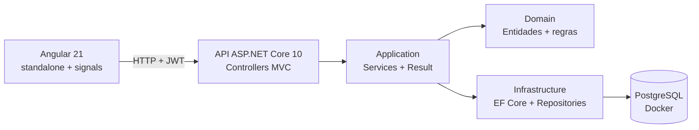

# Sistema de Gestão de Colaboradores e Unidades

<!-- TODO: uma frase de apresentação + GIF de ~20s navegando no portal -->

Gestão de usuários, colaboradores e unidades com API ASP.NET Core (MVC), portal Angular e PostgreSQL.

## Como rodar

```bash
docker compose up
```

- **API + Swagger:** http://localhost:5000/swagger
- **Portal:** `cd frontend && npm install && npm start` → http://localhost:4200
- **Login de avaliação:** `admin` / `admin123`

> O startup aplica as migrations e semeia o banco automaticamente — inclusive uma
> unidade **inativa** (`UNI-002`) para testar a regra de bloqueio na hora.

## Arquitetura



Quatro camadas em uma única solution — deliberadamente **não** é Clean Architecture com
N projetos: para um domínio de 3 entidades, isso seria complexidade sem retorno.

## Patterns aplicados

| Pattern | Onde | Por quê |
|---------|------|---------|
| **Herança + Template Method** | [`BaseEntity` / `EntidadeAtivavel`](backend/src/GestaoColaboradores.Domain/Common/) | Requisito do teste resolvido com regra real: `Unidade` herda ativação e expõe `PodeReceberColaborador` |
| **Factory Method** | [`Colaborador.Criar`](backend/src/GestaoColaboradores.Domain/Entidades/Colaborador.cs) | Construtor privado: a entidade nunca existe em estado inválido |
| **Repository + Unit of Work** | [`Repository<T>` / `UnitOfWork`](backend/src/GestaoColaboradores.Infrastructure/Persistence/) | UoW é uma casca fina — o `DbContext` do EF Core já implementa o pattern via `SaveChanges` |
| **Result Pattern** | [`Result.cs`](backend/src/GestaoColaboradores.Application/Common/Result.cs) | Falha de regra de negócio não é exceção; o controller base traduz em 404/409/422 |
| **Strategy** | [`IPasswordHasher` → BCrypt](backend/src/GestaoColaboradores.Infrastructure/Auth/BCryptPasswordHasher.cs) | Algoritmo de hash trocável e mockável nos testes |
| **Options** | [`JwtSettings`](backend/src/GestaoColaboradores.Infrastructure/Auth/JwtSettings.cs) | Configuração tipada, o idiomático .NET |

**Deliberadamente evitados:** CQRS/MediatR (peso morto para 3 entidades), Domain Events
(nenhum efeito colateral no enunciado justifica), Clean Architecture multi-projeto e
**transações explícitas** — o `SaveChanges` do EF Core já é transacional e a arquitetura faz
um único commit por operação, então `BeginTransaction` só acrescentaria cerimônia. A
concorrência entre requisições simultâneas é resolvida pelo índice único, não por transação.

## Decisões de domínio

<!-- TODO: preencher conforme implementar -->

- **Unidade inativa não recebe colaborador** — regra expressa no domínio
  (`Unidade.PodeReceberColaborador` + guarda em `Colaborador.Criar`), retornando **422**
  na API e refletida no portal (o select de unidades só lista ativas).
- **Update de usuário limitado a senha e status por contrato**: o DTO de atualização só
  possui esses dois campos — a API impede o erro em vez de validá-lo depois.
- **Remoção de colaborador:** <!-- TODO: documentar a decisão sobre o usuário vinculado -->
- **Senhas:** BCrypt; hash jamais exposto em resposta.
- **Limites de tamanho em constante única** — `BaseEntity.TamanhoMaximoCodigo` e afins são
  lidos tanto pela validação do domínio quanto pelo `HasMaxLength` do schema, de modo que o
  domínio não tem como aceitar um valor que a coluna rejeitaria.
- **Normalização de entrada na borda, com opt-out explícito** — toda string do corpo da
  requisição perde os espaços das pontas na desserialização, então nenhuma camada abaixo
  precisa lembrar de limpar. Um `JsonConverter<string>` global não bastaria, porque ele
  enxerga o valor e não a propriedade de origem: a customização de contrato
  (`Normalizacao.Configurar`) roda quando os atributos ainda são visíveis e pula o que estiver
  marcado com `[NaoNormalizar]`.
- **Senha nunca é normalizada** — os campos de senha carregam `[NaoNormalizar]`. Cortar
  espaços alteraria em silêncio o que a pessoa digitou, e passphrases com espaço são mais
  fortes, não mais fracas: o NIST SP 800-63B recomenda aceitar todo caractere imprimível e
  desaconselha regras de composição que reduzam o espaço de senhas.
- **`Colaborador` é entidade de primeira classe, não parte do agregado `Unidade`** — um
  desenho estrito de DDD faria `unidade.AdicionarColaborador(...)`, com a unidade como raiz.
  Optei pelo acesso direto porque o enunciado exige código único e CRUD próprios para
  colaborador, o que exigiria carregar a unidade inteira a cada operação.

## API

Autenticação: `POST /api/v1/auth/login` → Bearer token (só usuário **ativo** loga).
Todos os demais endpoints exigem o token.

| Método | Rota | Descrição |
|--------|------|-----------|
| GET | `/api/v1/usuarios?ativo=` | Lista usuários, com filtro opcional por status |
| POST | `/api/v1/usuarios` | Cadastra usuário |
| PUT | `/api/v1/usuarios/{id}` | Atualiza **somente** senha e status |
| GET | `/api/v1/colaboradores` | Lista colaboradores com a unidade |
| POST | `/api/v1/colaboradores` | Cadastra colaborador (409 duplicado / 422 unidade inativa) |
| PUT | `/api/v1/colaboradores/{id}` | Atualiza nome e unidade |
| DELETE | `/api/v1/colaboradores/{id}` | Remove colaborador |
| GET | `/api/v1/unidades` | Lista unidades com seus colaboradores |
| POST | `/api/v1/unidades` | Cadastra unidade |
| PUT | `/api/v1/unidades/{id}` | Atualiza nome / ativa / inativa |

Erros seguem **ProblemDetails (RFC 7807)**.
Collection do Postman com auto-token e casos de erro: [`postman/`](postman/).

## Testes

```bash
cd backend
dotnet test
```

- **Unidade** (xUnit + NSubstitute): regras de negócio no domínio e nos services.
- **Integração** (`WebApplicationFactory` + **Testcontainers**): PostgreSQL real em
  container por suíte — sem InMemory provider mascarando comportamento.

## Desenvolvimento local

As ferramentas de build são locais ao repositório (`.config/dotnet-tools.json`), então o
`dotnet-ef` vem na versão exata usada aqui — sem depender do que está instalado na máquina:

```bash
dotnet tool restore
```

```bash
cd backend
dotnet run --project src/GestaoColaboradores.Api
```

A migration inicial já está versionada em `Infrastructure/Migrations` e é aplicada no
startup. Para criar novas:

```bash
dotnet ef migrations add <Nome> -p src/GestaoColaboradores.Infrastructure -s src/GestaoColaboradores.Api
```

<!-- TODO: badge do GitHub Actions quando o CI estiver configurado -->
